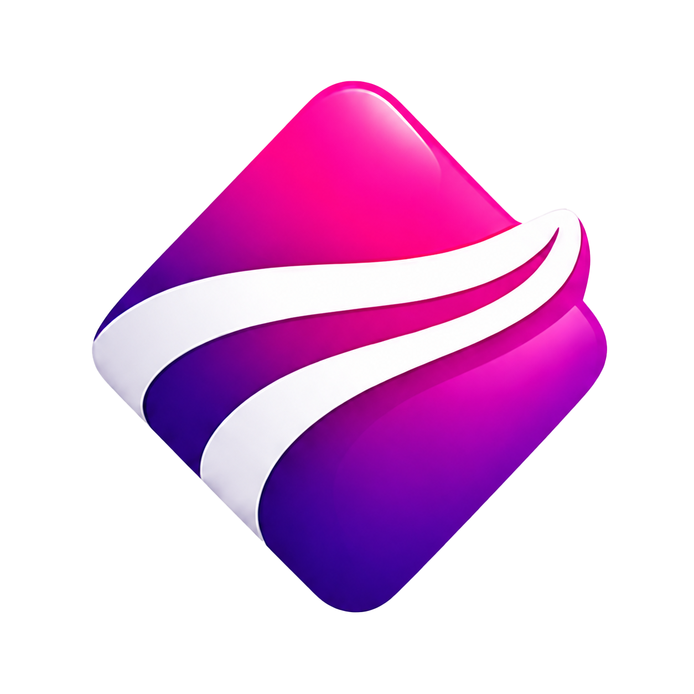
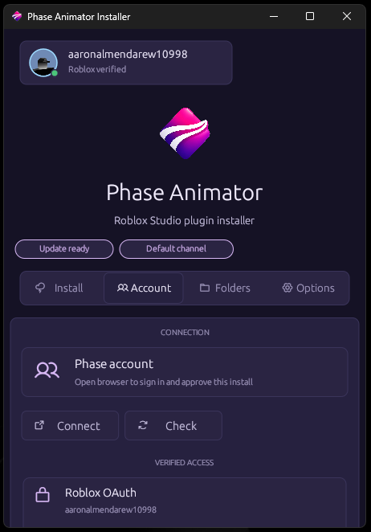

# Phase Auto Updater

<p align="center">
  
</p>

Native updater and installer for the Phase Animator Roblox Studio plugin.

This is the public client app. It is written in Rust with egui so it can feel close to the plugin without needing a browser wrapper.

The updater connects to Phase, checks for the latest release, and installs the plugin into the local Roblox Studio plugins folder. It is meant to be small, native, and easy to build from source.

<p align="center">
  
</p>

## what it does

- detects the Roblox Studio plugin folder on Windows and macOS
- lets you pick a folder manually when Roblox uses a different local path
- connects a Phase account
- supports Roblox OAuth verification
- supports license key activation
- watches for new updater events and sends a desktop notification
- downloads the plugin `.rbxm`
- checks the file hash before replacing local files
- makes a backup of the existing plugin file first
- checks GitHub Releases for newer installer builds

The UI is compact and shaped like a small installer. Long account names and file paths use horizontal scrolling so they do not break the layout.

## building it

Windows:

```powershell
.\scripts\build-windows.ps1
```

Windows MSI:

```powershell
.\scripts\build-msi.ps1
```

This creates both:

- `dist/windows/PhaseAnimatorSetup.exe`
- `dist/windows/PhaseAutoUpdater-<version>.msi`

`PhaseAnimatorSetup.exe` is the Windows setup app to share with most users. It carries the MSI inside it, shows the normal installer wizard, installs per-user, creates desktop/start menu shortcuts, enables startup, and launches the app when setup finishes.
Running the same setup again repairs or reinstalls the app.

```powershell
.\dist\windows\PhaseAnimatorSetup.exe
```

macOS:

```bash
bash ./scripts/build-macos.sh
```

For just running locally:

```bash
cargo run --bin phase-tool
```

## github builds

There are GitHub Actions in `.github/workflows`:

- `build.yml` builds Windows and macOS on pushes / PRs and uploads artifacts.
- `release.yml` builds `PhaseAnimatorSetup.exe`, the Windows MSI, and the macOS zip when a tag like `v0.1.4` is pushed.

When a GitHub Release has a newer `PhaseAutoUpdater-*.msi` asset, the app shows it in the Options tab and can launch the installer update.

macOS still needs signing and notarization before a public customer release. The app bundle script is here, but the Apple packaging pass still needs to happen on macOS or CI.

## repo notes

`dev-notes.md` tracks a few release and maintenance notes that should stay visible while this is being prepared for public use.
