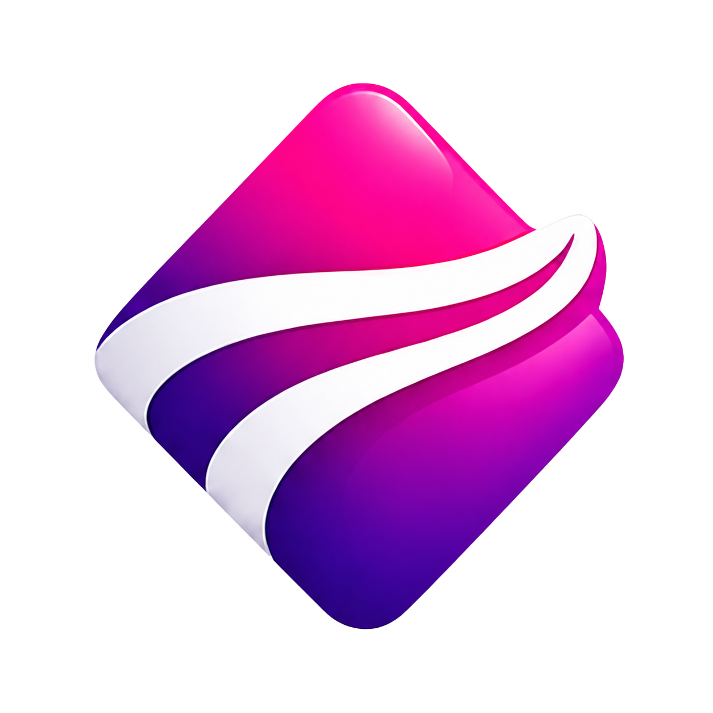

# Phase Companion

<p align="center">
  
</p>

Native companion app for the Phase Animator Roblox Studio plugin.

This is the public client app. It is written in Rust with egui so it can feel close to the plugin without needing a browser wrapper.

The companion connects to Phase, checks for the latest release, installs the plugin into the local Roblox Studio plugins folder, and runs local video-reference sync.

## what it does

- detects the Roblox Studio plugin folder on Windows and macOS
- lets you pick a folder manually when Roblox uses a different local path
- connects a Phase account
- supports Roblox OAuth verification
- supports license key activation
- can apply public Phase marketplace themes to the installer UI
- opens a Video Reference tab for syncing Phase Animator to YouTube or local video files
- runs a local `ws://127.0.0.1:27731/phase-video-reference` bridge for Studio timeline/playback sync
- offers a Windows-only Studio shortcut toggle that signature-scans compatible builds, changes one verified byte, and keeps the original executable as an adjacent `.bak`
- renders local MP4/MOV/M4V/WebM files in a native popup with custom controls, volume, scrubbing, rate, loop, fullscreen, swap video, and show-folder actions
- embeds YouTube with the native YouTube player while still listening for play, pause, seek, and rate sync events
- watches for new updater events and sends a desktop notification
- downloads the plugin `.rbxm`
- checks the file hash before replacing local files
- makes a backup of the existing plugin file first
- checks GitHub Releases for newer installer builds

The UI is a sidebar shell with four pages: Home, Reference, Account, and Settings. Home leads with a card that states the next required step and offers one primary action, with clickable status tiles for install location, account, and plugin version below. Reference combines a drop zone, a link field, a now-playing card with scrubber and transport, and collapsible timing options. Account covers the Phase account, Roblox verification, and license keys. Settings groups appearance, installation, Studio, connections, about, and reset controls. The sidebar collapses to an icon rail below 720 points (the minimum window is 560 × 480; the default is 800 × 560). All colors come from the active theme, so marketplace themes restyle every surface.

## building it

Windows app only:

```powershell
.\scripts\build-windows.ps1 -Arch x64
```

Windows MSI:

```powershell
.\scripts\build-msi.ps1 -Arch x64
.\scripts\build-msi.ps1 -Arch x86
.\scripts\build-msi.ps1 -Arch arm64
```

This creates architecture-specific packages:

- `dist/windows/x64/PhaseAnimatorSetup-x64.exe`
- `dist/windows/x86/PhaseAnimatorSetup-x86.exe`
- `dist/windows/arm64/PhaseAnimatorSetup-arm64.exe`
- matching `PhaseAutoUpdater-<version>-<arch>.msi` files

`PhaseAnimatorSetup-x64.exe` is for normal 64-bit Intel/AMD Windows. `PhaseAnimatorSetup-x86.exe` is for 32-bit Windows. `PhaseAnimatorSetup-arm64.exe` is for native Windows on ARM. The setup app carries the matching MSI inside it, shows the normal installer wizard, installs per-user, creates desktop/start menu shortcuts, enables startup, and launches Phase Companion when setup finishes.
Running the same setup again repairs or reinstalls the app.

Local ARM64 builds require the Visual Studio C++ ARM64 tools component (`Microsoft.VisualStudio.Component.VC.Tools.ARM64`). GitHub-hosted Windows runners include the required ARM64 C++ toolchain.

```powershell
.\dist\windows\x64\PhaseAnimatorSetup-x64.exe
```

macOS:

```bash
bash ./scripts/build-macos.sh
```

This creates `dist/macos/Phase Companion.app` and a drag-to-Applications
`dist/macos/Phase Companion.dmg`. Free, ad-hoc-signed builds require a one-time
Gatekeeper approval: open the app once, then go to **System Settings → Privacy &
Security**, click **Open Anyway** for Phase Companion, and confirm. Only download
it from this repository's releases, and don't disable Gatekeeper globally.

For just running locally:

```bash
cargo run --bin phase-tool
```

For video popup debugging:

```bash
cargo run --bin phase-tool -- --video-popup <path-to-rendered-player-html>
```

## github builds

There are GitHub Actions in `.github/workflows`:

- `build.yml` builds Windows x64, x86, arm64, and macOS on pushes / PRs and uploads artifacts.
- `release.yml` builds `PhaseAnimatorSetup-x64.exe`, `PhaseAnimatorSetup-x86.exe`, `PhaseAnimatorSetup-arm64.exe`, matching Windows MSIs, and the Phase Companion macOS zip and DMG when a tag like `v0.20.14` is pushed.

When a GitHub Release has a newer `PhaseAutoUpdater-*-<arch>.msi` asset, the app shows it in the Options tab and launches the installer update matching the current Windows architecture.

The macOS workflow produces an ad-hoc-signed build by default. It can optionally
use a Developer ID identity through `MACOS_SIGN_IDENTITY`; without one, users
must approve Phase Companion once in Privacy & Security.

## latest update

`0.21.1` lets Early Access testers switch between the stable and Early Access plugin from Home with a single Stable / Early Access control.

`0.21.0` redesigns the companion: a sidebar with Home, Reference, Account and Settings pages; spring-based motion; a cleaner pop-out video player with icon controls; an inspector-style timing panel; Windows 11 Mica; theme-tinted app, taskbar and tray icons; readable status colors on any theme; and remembered window size and position.

`0.20.14` fixes macOS title-bar spacing and theme integration, packages the app
as Phase Companion with an app icon and drag-to-Applications DMG, preserves
valid Roblox purchase authorization during installs, and surfaces real install
errors in the Updates page.

`0.20.2` adds a guarded Roblox plugin settings recovery tool with selectable backup/delete for Phase themes and keybinds.

`0.20.1` fixes marketplace theme application for the current PA2 JSON theme-code format.

`0.20.0` adds architecture-specific Windows setup packages for x64, x86, and arm64 so customers on 32-bit Windows or Windows on ARM do not receive an incompatible setup executable.

## repo notes

Only source code and the files needed to build and release it are published here; `.gitignore` is an allowlist. Personal Early Access builds are delivered by the authenticated Phase service.
