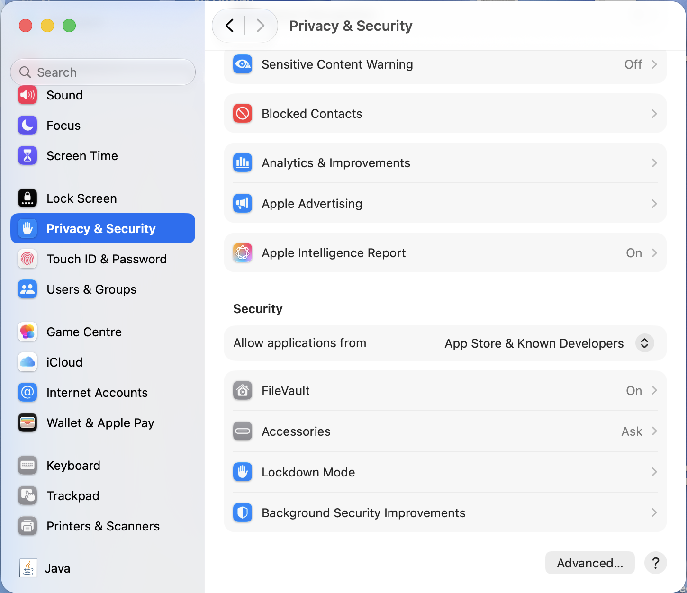

# Installing Phase Companion on macOS

Phase Companion is distributed as a drag-to-Applications disk image. The free
release is ad-hoc signed rather than registered with Apple's paid Developer ID
program, so macOS requires a one-time manual approval.

## Install

1. Download `Phase Companion.dmg` from the official GitHub release.
2. Open the disk image.
3. Drag **Phase Companion** into the **Applications** folder.
4. Open Phase Companion from Applications once. macOS may block the first
   launch because the developer cannot be verified.
5. Open **System Settings**, select **Privacy & Security**, and scroll to the
   **Security** section.
6. Click **Open Anyway** for Phase Companion, authenticate with your Mac
   password, and confirm **Open**.

After approval, Phase Companion is saved as an exception and can be opened
normally. A newly downloaded release may require the approval again.

Only download Phase Companion from the official GitHub repository. Do not
disable Gatekeeper globally.
